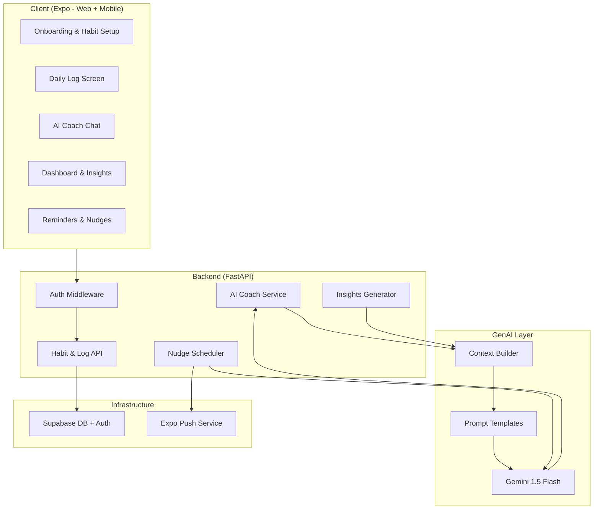

Great idea — behavior change is a domain where GenAI can genuinely add value beyond simple tracking apps. Let me make sure I understand the scope before diving into planning.

You want to build a GenAI-powered app that helps users break harmful habits (e.g., excessive screen time, social media, substance use, etc.) through intelligent nudges, personalized coaching, and adaptive support.

Let me start with a few scoping questions:

---

**[1]: What is the primary platform/interface for this solution?**
a. **Web app** - Browser-based, accessible on any device, easier to deploy
b. **Mobile app** - Native iOS/Android, enables push notifications and screen time APIs
c. **Web + Mobile** - Full cross-platform experience, higher complexity
d. **Other** - CLI, Slack bot, browser extension, etc.

**[2]: Which habits/addictions should the solution target?**
a. **Screen time & social media** - Focused scope, measurable via device APIs
b. **Substance use (alcohol, smoking, etc.)** - Requires more sensitive handling, crisis protocols
c. **Broad/general habits** - User defines their own habit (e.g., overeating, gambling, procrastination)
d. **All of the above** - Flexible platform supporting multiple habit types

**[3]: What is your tech stack preference or constraint?**
a. **Specific stack** - e.g., React + Node.js, Python/FastAPI, Next.js — tell me what you prefer
b. **Open to suggestions** - I'll recommend based on the feature needs
c. **Existing codebase** - There's already a project started I should work within

*(Use the chat to answer any subset, e.g., "1=a, 2=c, 3=b" or provide your own answers)*

---

Perfect context — hackathon mode means we optimize for speed, free tiers, and a deployable demo. Let me dig a bit deeper on the product experience before designing the stack.

---

**[1]: What are the core GenAI-powered features you want to prioritize for the hackathon demo?**
a. **Intelligent nudges** - AI sends timely, context-aware push notifications to interrupt habit triggers
b. **Adaptive coaching** - Conversational AI coach that responds to user check-ins and progress
c. **Personalized insights** - AI analyzes patterns and generates weekly summaries/recommendations
d. **All three** - Full experience (higher scope, but doable if we keep each one lean)

**[2]: How should habit tracking work?**
a. **Manual logging** - User self-reports when they engage in the habit (simple, fast to build)
b. **Goal + streak tracking** - User sets a target (e.g., "max 1hr social media/day") and logs progress
c. **Both** - Manual log + streak/goal system with AI responding to the data
d. **Automatic detection** - Requires device APIs (screen time, etc.) — complex, skip for hackathon

**[3]: What should the AI "coach" feel like?**
a. **Chat interface** - User can talk to an AI coach anytime, like a supportive therapist
b. **Push-only** - AI only reaches out proactively, no back-and-forth conversation
c. **Hybrid** - AI sends nudges AND user can reply/chat when they want support
d. **Guided programs** - AI generates a structured multi-week plan the user follows

*(e.g., "1=d, 2=c, 3=c" or describe your own vision)*

---

Great, the picture is getting clear. One final round before I move into stack research and planning:

---

**[1]: For the AI coach chat — what tone and persona should it have?**
a. **Empathetic therapist** - Warm, non-judgmental, motivational interviewing style
b. **Strict accountability partner** - Direct, challenges excuses, keeps user honest
c. **Adaptive** - AI reads the user's mood/context and adjusts tone accordingly
d. **User chooses** - Let the user pick their coach persona during onboarding

**[2]: For auto-detection of habits — what's realistic for the hackathon scope?**
a. **Skip it** - Manual logging only, keep scope tight
b. **Screen time via browser extension** - Detects time on specific websites (web only)
c. **Usage stats via mobile APIs** - React Native can access some app usage data on Android
d. **Simple heuristics** - If user hasn't logged by a set time, AI sends a check-in nudge (lightweight "detection")

**[3]: For deployment & LLM — any preference on these free-tier options?**
a. **Groq + Llama 3** - Extremely fast inference, generous free tier, best for hackathon speed
b. **Google Gemini API** - Free tier available, multimodal capable, good context window
c. **Ollama (self-hosted)** - Run open-source models locally/on a server, fully free but needs hosting
d. **OpenAI GPT-4o-mini** - Small free credit, widely known API, easy to use

*(e.g., "1=c, 2=d, 3=a" or mix and match)*

---

Excellent — the hackathon guidelines are very clear. Key takeaways I'm designing around:

- **High impact**: Code quality + problem statement alignment (these win the leaderboard)
- **Every GenAI feature must be a real working API call** — no mocks, no fake data
- **Security & efficiency matter** — not just a working demo
- **Accessibility counts** when scores are close

Let me now design the full plan.

---

## My Recommendations (before the plan)

**LLM: Google Gemini 1.5 Flash** — This is a Google for Developers hackathon (PromptWars), so using Google's own Gemini API is strategically smart for alignment scoring. Free tier is generous (15 RPM, 1M tokens/day).

**Auto-detection: Lightweight heuristics** — If the user hasn't logged by a scheduled reminder time, AI sends a proactive check-in. Simple, works cross-platform, no complex device APIs needed for hackathon scope.

**Stack:**
- **Frontend**: React Native (Expo) — single codebase for mobile + web
- **Backend**: FastAPI (Python) — fast to build, great for AI integration
- **Database**: Supabase (free tier) — auth + PostgreSQL + real-time
- **Notifications**: Expo Push Notifications (free)
- **LLM**: Google Gemini 1.5 Flash API (free tier)
- **Deployment**: Railway or Render (free tier backend) + Expo Go (mobile) + Vercel (web)

---

Now here's the full implementation plan:

---

# Implementation Plan — HabitHeal: AI-Powered Habit Breaking App

## Problem Statement
Users struggle to break harmful self-defined habits due to lack of personalized support, accountability, and timely intervention. Existing apps are generic and passive. HabitHeal uses GenAI to deliver an empathetic AI coach, intelligent nudges, personalized insights, and adaptive tracking — all in a cross-platform app (mobile + web).

## Requirements

- User-defined habits (any type: screen time, smoking, overeating, etc.)
- Manual habit logging with timestamps and intensity/notes
- Goal setting (daily limits, streak targets) with reminder scheduling
- AI coach chat — empathetic, available 24/7, context-aware of user's habit history
- Intelligent nudges — AI-generated proactive messages based on patterns and missed logs
- Personalized insights — AI-generated weekly summaries and behavior analysis
- Cross-platform: React Native (Expo) for mobile + web
- All GenAI calls must be real Gemini API calls — no mocks

## Background & Tech Decisions

| Concern | Choice | Reason |
|---|---|---|
| LLM | Gemini 1.5 Flash | Google hackathon, free tier (1M tokens/day), fast |
| Frontend | React Native + Expo | Single codebase, web + mobile, fast to build |
| Backend | FastAPI (Python) | Lightweight, async, great AI/LLM integration |
| Database & Auth | Supabase | Free tier, built-in auth, PostgreSQL, real-time |
| Notifications | Expo Push Notifications | Free, cross-platform |
| Deployment | Render (backend) + Vercel (web) | Free tier, simple CI/CD |

## Architecture

## Proposed Solution

A mobile-first (also web-accessible) app where users define their habits, log their daily struggles and wins, chat with an empathetic AI coach powered by Gemini, and receive proactive nudges and weekly AI-generated insights. The AI always has context of the user's habit history, recent logs, and streak data when generating responses.

---

## Task Breakdown

**Task 1: Project Scaffold & Supabase Setup**
- Objective: Bootstrap the monorepo with Expo (frontend) and FastAPI (backend), connect to Supabase
- Implementation:
  - Initialize Expo app with TypeScript (`npx create-expo-app`)
  - Initialize FastAPI project with folder structure (`/routers`, `/services`, `/models`)
  - Set up Supabase project: create tables for `users`, `habits`, `logs`, `chat_messages`, `nudges`
  - Configure Supabase auth (email/password + magic link)
  - Set up environment variable handling (`.env` with Supabase URL/key, Gemini API key)
  - Add basic health check endpoint on FastAPI
- Tests: Supabase connection test, FastAPI `/health` returns 200
- Demo: Backend running locally, Supabase tables created, Expo app launches on web and mobile simulator

---

**Task 2: Authentication Flow**
- Objective: Users can register, log in, and maintain sessions across web and mobile
- Implementation:
  - Supabase Auth integration in Expo using `@supabase/supabase-js`
  - Register screen (email + password), Login screen, session persistence with SecureStore
  - FastAPI middleware to validate Supabase JWT tokens on protected routes
  - Navigation guard — unauthenticated users redirected to login
  - Accessibility: form labels, keyboard navigation, error announcements via `accessibilityLabel`
- Tests: Auth middleware unit test (valid/invalid JWT), login/register flow test
- Demo: User can register, log in, log out, and session persists on app reload

---

**Task 3: Habit Definition & Management**
- Objective: Users can create, edit, and delete custom habits they want to break
- Implementation:
  - "Add Habit" screen: name, description, category (screen time / substance / eating / custom), daily goal (e.g., max 1hr), target start date
  - FastAPI `/habits` CRUD endpoints (POST, GET, PUT, DELETE) with user-scoped queries
  - Habit list screen showing all active habits with streak counter (calculated from logs)
  - Input validation on both frontend and backend (sanitized, length-limited)
- Tests: CRUD endpoint tests with valid/invalid payloads, streak calculation unit test
- Demo: User can create "Reduce Instagram to 30 min/day", see it in their habit list with a streak of 0

---

**Task 4: Daily Habit Logging**
- Objective: Users can log their habit activity each day with notes and intensity
- Implementation:
  - Log entry screen per habit: date (defaults to today), duration/count, intensity slider (1-5), optional notes, "I resisted!" vs "I slipped" toggle
  - FastAPI `/logs` endpoints (POST, GET by habit/date range)
  - Streak recalculation on every log submission
  - Visual streak display (calendar heatmap or streak counter) on habit detail screen
  - Reminder scheduling: user sets reminder times, stored in DB, Expo local notifications trigger them
- Tests: Log creation test, streak logic edge cases (missed day resets streak), reminder scheduling test
- Demo: User logs "used Instagram for 45 min today, felt anxious (intensity 3)", sees streak update to Day 1

---

**Task 5: AI Coach Chat (Core GenAI Feature)**
- Objective: Users can chat with an empathetic AI coach powered by Gemini that knows their habit history
- Implementation:
  - Chat UI screen (bubble layout, accessible, keyboard-aware scroll)
  - FastAPI `/chat` endpoint: receives user message, builds context from recent logs + habit data, calls Gemini 1.5 Flash API with a structured system prompt
  - System prompt enforces empathetic therapist persona, awareness of user's specific habit, recent progress, and streak
  - Conversation history stored in `chat_messages` table (last 20 messages sent as context)
  - Streaming response support for real-time feel (Gemini streaming API)
  - Input sanitization, rate limiting (10 messages/min per user)
- Tests: Chat endpoint integration test with real Gemini call, context injection test, rate limit test
- Demo: User types "I relapsed today, I feel terrible" — AI responds with empathy, references their 5-day streak, offers coping strategies specific to their habit

---

**Task 6: Intelligent Nudges (Proactive AI Notifications)**
- Objective: AI proactively sends personalized push notifications based on user patterns and missed logs
- Implementation:
  - Background scheduler in FastAPI (APScheduler) runs every hour
  - Logic: if user has a reminder set and hasn't logged today → trigger nudge generation
  - Nudge generation: calls Gemini with user's habit context + time of day + streak status → generates a short, personalized motivational message (not a generic template)
  - Send via Expo Push Notifications API
  - Nudge history stored in DB, displayed in a "Notifications" tab
  - Users can configure nudge frequency (off / gentle / regular)
- Tests: Scheduler trigger test, nudge generation test (verifies real Gemini call), push notification delivery test
- Demo: Simulate a missed log → scheduler fires → user receives "Hey [name], you're on a 3-day streak with reducing smoking — don't break it now! How are you feeling today?" on their phone

---

**Task 7: Personalized AI Insights (Weekly Analysis)**
- Objective: AI generates a weekly summary analyzing patterns and giving personalized recommendations
- Implementation:
  - FastAPI `/insights/weekly` endpoint: aggregates last 7 days of logs for all habits
  - Calls Gemini with structured data (log frequency, avg intensity, slip days, best days) and prompts for a narrative analysis + 3 actionable recommendations
  - Insights screen in app showing the AI-generated report with charts (using Victory Native or react-native-chart-kit)
  - Charts: weekly log frequency bar chart, intensity trend line — real data from logs
  - Auto-trigger weekly on Sunday evening via scheduler; also accessible on-demand
- Tests: Insights endpoint test with real Gemini call, chart rendering test with sample data
- Demo: User taps "My Weekly Report" → sees AI-generated paragraph: "You struggled most on weekdays between 6-8pm. Your Instagram usage was 40% lower than last week. Try replacing that time slot with a 10-minute walk."

---

**Task 8: Dashboard, Accessibility & Polish**
- Objective: Unified home dashboard, full accessibility pass, and production deployment
- Implementation:
  - Home dashboard: active habits summary, today's log status, streak highlights, quick-access to coach chat
  - Accessibility audit: all interactive elements have `accessibilityLabel`, color contrast WCAG AA, screen reader tested on iOS VoiceOver / Android TalkBack
  - Error boundaries, loading states, empty states for all screens
  - Security review: JWT validation on all routes, no secrets in frontend, parameterized DB queries
  - Deploy backend to Render (free tier), frontend web to Vercel, mobile via Expo Go with published build
  - README with setup instructions and test credentials for evaluators
- Tests: End-to-end smoke test covering login → add habit → log → chat → view insights, accessibility lint check
- Demo: Full walkthrough from onboarding to AI coach chat to weekly insights — fully deployed, accessible via URL and Expo Go QR code

---

Does this plan look good, or would you like me to adjust anything? (e.g., swap any tech choices, add/remove features, reorder tasks, or go deeper on any specific area)

---

Here's the complete plan to hand off for execution. Switch to **Default or Autonomous mode** to start building.

---

# Implementation Plan — HabitHeal: AI-Powered Habit Breaking App

## Problem Statement
Users struggle to break harmful self-defined habits due to lack of personalized support, accountability, and timely intervention. HabitHeal uses GenAI to deliver an empathetic AI coach, intelligent nudges, personalized insights, and adaptive tracking — all in a cross-platform app (mobile + web).

## Requirements
- User-defined habits (any type: screen time, smoking, overeating, etc.)
- Manual habit logging with timestamps and intensity/notes
- Goal setting (daily limits, streak targets) with reminder scheduling
- AI coach chat — empathetic, available 24/7, context-aware of user's habit history
- Intelligent nudges — AI-generated proactive messages based on patterns and missed logs
- Personalized insights — AI-generated weekly summaries and behavior analysis
- Cross-platform: React Native (Expo) for mobile + web
- All GenAI calls must be real Gemini API calls — no mocks

## Tech Stack
| Concern | Choice |
|---|---|
| LLM | Gemini 1.5 Flash (free tier) |
| Frontend | React Native + Expo (TypeScript) |
| Backend | FastAPI (Python) |
| Database & Auth | Supabase (free tier) |
| Notifications | Expo Push Notifications |
| Deployment | Render (backend) + Vercel (web) |

## Architecture

## Task Breakdown

**Task 1: Project Scaffold & Supabase Setup**
- Objective: Bootstrap the monorepo with Expo (frontend) and FastAPI (backend), connect to Supabase
- Implementation:
  - Initialize Expo app with TypeScript (`npx create-expo-app`)
  - Initialize FastAPI project with folder structure (`/routers`, `/services`, `/models`)
  - Set up Supabase project: create tables for `users`, `habits`, `logs`, `chat_messages`, `nudges`
  - Configure Supabase auth (email/password + magic link)
  - Set up environment variable handling (`.env` with Supabase URL/key, Gemini API key)
  - Add basic health check endpoint on FastAPI
- Tests: Supabase connection test, FastAPI `/health` returns 200
- Demo: Backend running locally, Supabase tables created, Expo app launches on web and mobile simulator

---

**Task 2: Authentication Flow**
- Objective: Users can register, log in, and maintain sessions across web and mobile
- Implementation:
  - Supabase Auth integration in Expo using `@supabase/supabase-js`
  - Register screen (email + password), Login screen, session persistence with SecureStore
  - FastAPI middleware to validate Supabase JWT tokens on protected routes
  - Navigation guard — unauthenticated users redirected to login
  - Accessibility: form labels, keyboard navigation, error announcements via `accessibilityLabel`
- Tests: Auth middleware unit test (valid/invalid JWT), login/register flow test
- Demo: User can register, log in, log out, and session persists on app reload

---

**Task 3: Habit Definition & Management**
- Objective: Users can create, edit, and delete custom habits they want to break
- Implementation:
  - "Add Habit" screen: name, description, category (screen time / substance / eating / custom), daily goal, target start date
  - FastAPI `/habits` CRUD endpoints (POST, GET, PUT, DELETE) with user-scoped queries
  - Habit list screen showing all active habits with streak counter
  - Input validation on both frontend and backend
- Tests: CRUD endpoint tests with valid/invalid payloads, streak calculation unit test
- Demo: User can create "Reduce Instagram to 30 min/day", see it in their habit list with a streak of 0

---

**Task 4: Daily Habit Logging**
- Objective: Users can log their habit activity each day with notes and intensity
- Implementation:
  - Log entry screen: date, duration/count, intensity slider (1-5), notes, "I resisted!" vs "I slipped" toggle
  - FastAPI `/logs` endpoints (POST, GET by habit/date range)
  - Streak recalculation on every log submission
  - Visual streak display (calendar heatmap or streak counter)
  - Reminder scheduling: user sets reminder times, stored in DB, Expo local notifications trigger them
- Tests: Log creation test, streak logic edge cases, reminder scheduling test
- Demo: User logs "used Instagram for 45 min today", sees streak update to Day 1

---

**Task 5: AI Coach Chat (Core GenAI Feature)**
- Objective: Users can chat with an empathetic AI coach powered by Gemini that knows their habit history
- Implementation:
  - Chat UI screen (bubble layout, accessible, keyboard-aware scroll)
  - FastAPI `/chat` endpoint: receives message, builds context from recent logs + habit data, calls Gemini 1.5 Flash
  - System prompt enforces empathetic therapist persona with awareness of user's specific habit and streak
  - Conversation history stored in `chat_messages` table (last 20 messages as context)
  - Streaming response support for real-time feel
  - Input sanitization, rate limiting (10 messages/min per user)
- Tests: Chat endpoint integration test with real Gemini call, context injection test, rate limit test
- Demo: User types "I relapsed today, I feel terrible" — AI responds with empathy, references their streak, offers coping strategies

---

**Task 6: Intelligent Nudges (Proactive AI Notifications)**
- Objective: AI proactively sends personalized push notifications based on user patterns and missed logs
- Implementation:
  - Background scheduler (APScheduler) runs every hour
  - Logic: if user has a reminder set and hasn't logged today → trigger nudge generation via Gemini
  - Nudge history stored in DB, displayed in a "Notifications" tab
  - Users can configure nudge frequency (off / gentle / regular)
- Tests: Scheduler trigger test, nudge generation test (verifies real Gemini call), push notification delivery test
- Demo: Simulate missed log → user receives personalized AI-generated nudge on their phone

---

**Task 7: Personalized AI Insights (Weekly Analysis)**
- Objective: AI generates a weekly summary analyzing patterns and giving personalized recommendations
- Implementation:
  - FastAPI `/insights/weekly` endpoint: aggregates last 7 days of logs, calls Gemini for narrative analysis + 3 actionable recommendations
  - Insights screen with AI-generated report and charts (bar chart, intensity trend line)
  - Auto-trigger weekly on Sunday evening via scheduler; also accessible on-demand
- Tests: Insights endpoint test with real Gemini call, chart rendering test
- Demo: User sees AI-generated weekly report with real data analysis and specific recommendations

---

**Task 8: Dashboard, Accessibility & Polish**
- Objective: Unified home dashboard, full accessibility pass, and production deployment
- Implementation:
  - Home dashboard: active habits summary, today's log status, streak highlights, quick-access to coach
  - Accessibility audit: `accessibilityLabel` on all interactive elements, WCAG AA color contrast, screen reader tested
  - Error boundaries, loading states, empty states for all screens
  - Security review: JWT on all routes, no secrets in frontend, parameterized DB queries
  - Deploy backend to Render, web to Vercel, mobile via Expo Go with published build
  - README with setup instructions and test credentials for evaluators
- Tests: End-to-end smoke test covering full user journey, accessibility lint check
- Demo: Fully deployed app accessible via URL and Expo Go QR code, complete walkthrough from onboarding to insights

---

**Switch to Default or Autonomous mode to begin execution starting with Task 1.**

---

I'm a planning agent - I can read and analyze code but not modify it. I can help you plan the implementation instead.

To start building, you need to **switch out of Plan mode**:

1. Look for the mode selector in the Kiro interface (usually bottom of the chat or a dropdown near the input)
2. Switch to **Default** or **Autonomous** mode
3. Then send the message: **"start building"** or **"execute the plan starting with Task 1"**

The execution agent will have all the tools needed to create files, run commands, install dependencies, and build the full HabitHeal app. The complete plan above will serve as its guide.

---

It looks like you're still in Plan/Spec mode based on the implicit rules active in this session. I can't execute code or create files from here.

To actually build the project, here's what to do:

1. **Look for the mode switcher** in the Kiro chat interface — it's typically a dropdown or toggle near the chat input (may say "Plan", "Spec", or similar)
2. **Switch to "Default" or "Autonomous" mode**
3. **Paste this message** to kick off execution:

> Execute the HabitHeal implementation plan starting with Task 1. Create a monorepo with an Expo TypeScript frontend and FastAPI Python backend. Set up Supabase tables for users, habits, logs, chat_messages, and nudges. Add a /health endpoint to FastAPI and verify the Expo app runs on web.

That will give the execution agent the full context to start building immediately.